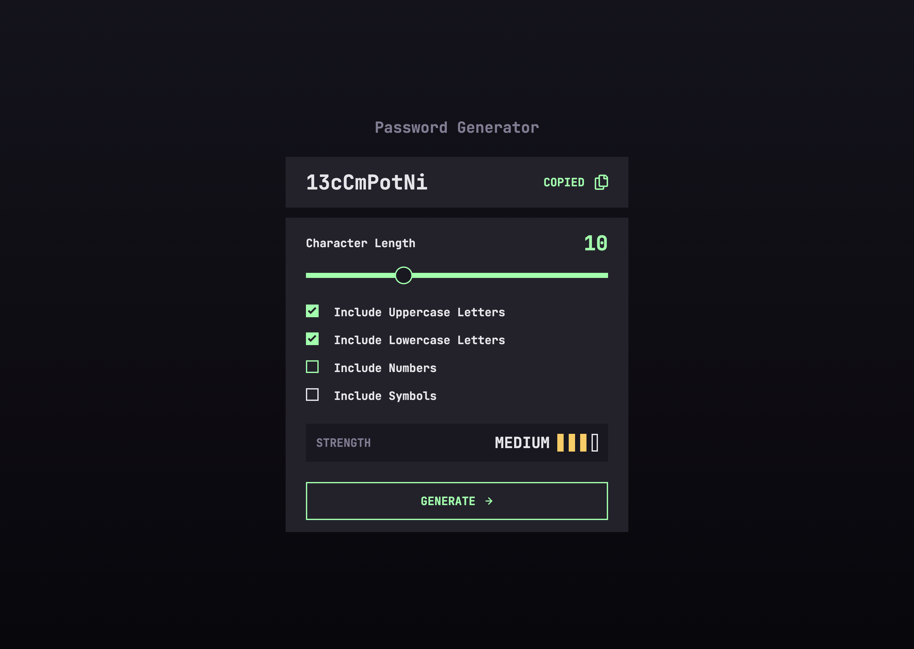

# Frontend Mentor - Password generator app solution

This is a solution to the [Password generator app challenge on Frontend Mentor](https://www.frontendmentor.io/challenges/password-generator-app-Mr8CLycqjh). Frontend Mentor challenges help you improve your coding skills by building realistic projects.

## Table of contents

- [Overview](#overview)
  - [The challenge](#the-challenge)
  - [Screenshot](#screenshot)
  - [Links](#links)
- [My process](#my-process)
  - [Built with](#built-with)
  - [What I learned](#what-i-learned)
  - [Continued development](#continued-development)
  - [Useful resources](#useful-resources)
- [Author](#author)

## Overview

### The challenge

Users should be able to:

- Generate a password based on the selected inclusion options
- Copy the generated password to the computer's clipboard
- See a strength rating for their generated password
- View the optimal layout for the interface depending on their device's screen size
- See hover and focus states for all interactive elements on the page

### Screenshot

|               Mobile designed at 375px:                |               Desktop designed at 1440px:               |
| :----------------------------------------------------: | :-----------------------------------------------------: |
|      |      |
|                Mobile (active states):                 |                Desktop (active states):                 |
|  |  |

### Links

- Solution URL: [https://github.com/elisilk/password-generator-app](https://github.com/elisilk/password-generator-app)
- Live Site URL: [https://elisilk.github.io/password-generator-app/](https://elisilk.github.io/password-generator-app/)

## My process

### Built with

- Semantic HTML5 markup
- CSS custom properties
- Flexbox
- CSS Grid
- Mobile-first workflow
- Fluid typography and spacing

### What I learned

- working with SVGs
- styling checkboxes
- styling ranges/sliders

- [SVG hover](https://css-tricks.com/change-color-of-svg-on-hover/) and the [different ways to use SVG in HTML markup](https://css-tricks.com/using-svg/)

### Continued development

Hmm 🤔 ...

Specific areas that the solution should be improved:

- In defiance of the design's "Empty" state, choose to set up initial state (in HTML and in JS) with some amount of checkboxes checked and the slider at some reasonable start value (e.g., 12)
- Get copy button functional
- Error checking
  - character length slider value > 0
  - at least one of the checkboxes checked
  - (make the error states show up somewhere?)
- Get checkbox list functional
- Decide what special characters are allowed
- Check over spacing and font sizes
- Why does the generate button stay active/focused after a click? What should happen?
- Use lambdatest to test on different browsers

More general ideas I want to consider:

### Useful resources

- [MDN Web Docs for CSS](https://developer.mozilla.org/en-US/docs/Web/CSS) - Went here a lot to reference the different CSS properties and the shorthands, and all the great explanations about best practices.
- [MDN Guides](https://developer.mozilla.org/en-US/docs/Learn) - So many resources and nice explanations, including stuff [tutorials specific to Javascript](https://developer.mozilla.org/en-US/docs/Web/JavaScript/Guide).
- [Every Layout](https://every-layout.dev/) - My go to source for thinking about layouts now.
- [The Clamp Calculator](https://royalfig.github.io/fluid-typography-calculator/) - Used for all of fluid typography and fluid spacing calculations.

## Author

- Website - [Eli Silk](https://github.com/elisilk)
- Frontend Mentor - [@elisilk](https://www.frontendmentor.io/profile/elisilk)
